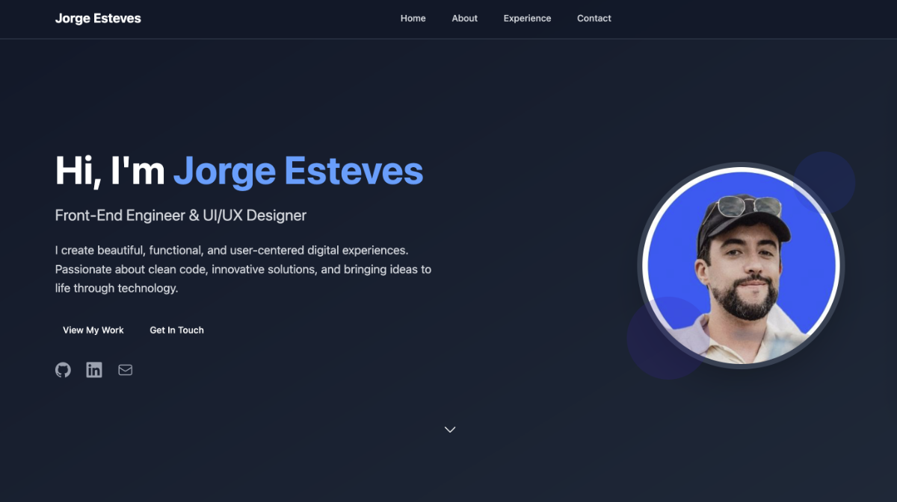

# Nuxt 3 UI Components Portfolio

[](https://nuxt.com/) [](https://www.typescriptlang.org/) [](https://tailwindcss.com/) [](https://vuejs.org/) [](https://docs.github.com/en/rest) [](https://pnpm.io/) [](https://opensource.org/licenses/MIT)



A modern, responsive portfolio website built with Nuxt 3, featuring reusable UI components and integration with GitHub API for dynamic content.

## ✨ Features

- **Modern Stack**: Built with Nuxt 3, TypeScript, and Tailwind CSS
- **Responsive Design**: Mobile-first approach with dark mode support
- **GitHub Integration**: Dynamic GitHub stats and repository showcase
- **LinkedIn Profile**: Professional profile integration
- **UI Components Library**: Reusable portfolio components including:
  - Hero section with animated elements
  - Interactive navigation
  - Experience timeline
  - Project showcase with GitHub API
  - Contact form
  - Social media integration

## 🛠️ Tech Stack

- **Framework**: [Nuxt 3](https://nuxt.com/)
- **UI Library**: [@nuxt/ui](https://ui.nuxt.com/)
- **Styling**: [Tailwind CSS](https://tailwindcss.com/)
- **Icons**: [Heroicons](https://heroicons.com/) & [Simple Icons](https://simpleicons.org/)
- **API Integration**: GitHub REST API via Octokit
- **Fonts**: Google Fonts integration
- **Language**: TypeScript
- **Package Manager**: pnpm

## 📦 Installation

Make sure to install dependencies using pnpm:

```bash
pnpm install
```

## 🚀 Development

Start the development server on `http://localhost:3000`:

```bash
pnpm dev
```

## 📁 Project Structure

```txt
app/
├── components/          # Reusable UI components
│   ├── Portfolio*.vue   # Portfolio-specific components
│   ├── GitHubDataDemo.vue
│   └── LinkedInProfile.vue
├── composables/         # Vue composables
│   ├── useGitHub.ts    # GitHub API integration
│   └── usePortfolio.ts # Portfolio data management
├── types/              # TypeScript type definitions
├── assets/             # Static assets and data
└── app.vue            # Main application component
```

## 🔧 Available Scripts

```bash
# Development
pnpm dev              # Start development server
pnpm devtools         # Enable Nuxt DevTools

# Building
pnpm build           # Build for production
pnpm generate        # Generate static site
pnpm preview         # Preview production build

# Quality Assurance
pnpm lint            # Run ESLint
pnpm lint:fix        # Fix ESLint errors
pnpm type-check      # Run TypeScript checks
pnpm test            # Run tests
pnpm test:watch      # Run tests in watch mode

# Maintenance
pnpm clean           # Clean build directories
pnpm upgrade         # Update dependencies
pnpm analyze         # Analyze bundle size
```

## 🎨 Customization

The portfolio can be easily customized by modifying the data in:

- `app/composables/usePortfolio.ts` - Personal information, skills, and experience
- `app/assets/resume/resume.json` - Resume data
- `app/composables/useGitHub.ts` - GitHub configuration

## 🌐 Production

Build the application for production:

```bash
pnpm build
```

Check out the [Nuxt deployment documentation](https://nuxt.com/docs/getting-started/deployment) for more information.

## 📄 License

This project is open source and available under the [MIT License](LICENSE).
